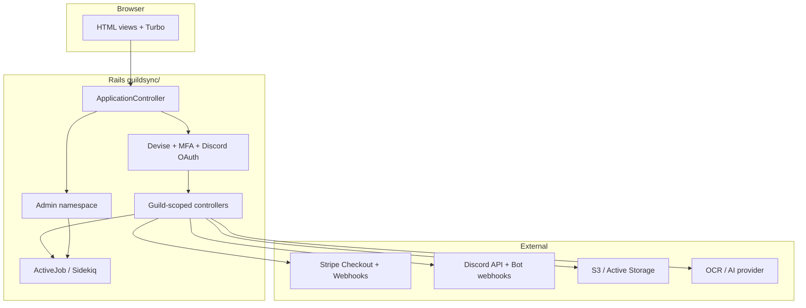

# End-to-end application flow (how pieces connect)

**Last updated:** 2026-04-06 (mega **#216** — reading order incl. **#219** sidebar row, money-path **#222** **`pricing_plans`**, API path, **`Guild`** role-column permission model; topology + cross-links)

This document is the **spine** that links `overall/*` and `systems/*`. Read it first, then drill into per-topic files.

## 0. Suggested reading order (overall maps)

| First | Then | Topic |
|-------|------|--------|
| [request_lifecycle.md](request_lifecycle.md) | [authentication_mfa.md](authentication_mfa.md) | Filters, **`public_page?`**, MFA (**mega #206**, **#194**) |
| [authorization.md](authorization.md) | [policies_pundit.md](../systems/policies_pundit.md) | Layers vs policy inventory (**mega #211**, **#188**) |
| [data_model_core.md](data_model_core.md) | Per-**`systems/`** map | **`User`** / **`Guild`** / **`Alliance`** hubs (**mega #209**) |
| [sidebar_navigation.md](../systems/sidebar_navigation.md) | [plan_entitlements.md](../systems/plan_entitlements.md) | Member app sidebar + **`plan_allows?`** keys (**mega #219**) |
| [i18n.md](i18n.md) | `config/locales/**` | Locale precedence + **`i18n-tasks`** (**mega #205**) |
| [storage_s3.md](storage_s3.md) | [storage_files.md](../systems/storage_files.md) | Blobs vs HTTP file UI (**mega #213**, **#186**) |
| [error_observability.md](error_observability.md) | Admin errors UI | Capture + Discord notify (**mega #196**) |
| [background_jobs.md](background_jobs.md) | `app/jobs/**`, `sidekiq.rb` | ActiveJob vs Sidekiq (**mega #212**) |

## 1. High-level topology

## 2. Request path (happy path)

1. **Rack** → Rails router (`guildsync/config/routes.rb`).
2. **`ApplicationController`** — locale, CSRF, `authenticate_user!`, MFA guards (`ensure_fully_authenticated`, `require_mfa_if_enabled`), `plan_allows?` helper for views.
3. **Tenant** — Many routes use `guilds/:guild_id` or `params[:id]`; `set_guild` loads `Guild` and checks membership or ownership via policies/helpers.
4. **Authorization** — Pundit (`authorize`) + `can_manage_*?` helpers that combine **guild owner**, **Discord-linked role slots on `Guild`** (`permission_role_*_id` + `role_*_*` flags via `Guild#role_permission_enabled_for?`), and sometimes **plan entitlements** (`PlanEntitlementService`). There is **no** separate `GuildRolePermission` model.
5. **Response** — HTML layout (**`application`** with viewport-responsive member chrome at **`lg`**, or **`application+mobile`** when **`request.variant`** selects the mobile UA template) or JSON (billing, APIs).

**API v1 (JSON):** `Api::V1::*` under `guildsync/app/controllers/api/v1/` — separate `BaseController` stack, JWT/session rules per route, `rescue_from Pundit::NotAuthorizedError` → **`api.v1.not_authorized`**. Web HTML behavior remains in `ApplicationController`.

**Deep dive:** [request_lifecycle.md](request_lifecycle.md), [authentication_mfa.md](authentication_mfa.md), [authorization.md](authorization.md).

## 3. Money path

1. User hits **pricing** → `PricingController` / `BillingController` / `SubscriptionsController`.
2. **`Billing::TrialPolicy`** decides whether Stripe `subscription_data.trial_period_days` applies (Basic-only).
3. **Stripe Checkout** completes → customer/subscription IDs on `User` / `Subscription`.
4. **Webhooks** — `Stripe::WebhooksController` verifies signature → `StripeWebhookProcessor` updates subscription state, Elite beta flag, free downgrade + `FreePlanDowngradeSideEffects` on cancel.

**Deep dive:** [billing_stripe_flow.md](billing_stripe_flow.md) (**mega #217**), [pricing_plans.md](../systems/pricing_plans.md) (**mega #222**), [stripe_webhooks.md](../systems/stripe_webhooks.md) (**mega #126**; cross-**#217**), [plan_entitlements.md](../systems/plan_entitlements.md), [free_downgrade_alliance.md](../systems/free_downgrade_alliance.md).

## 4. Guild / alliance path

1. **Guild** CRUD, settings, Discord channel picks, role sync — `GuildsController`, `GuildSettings`-related controllers, `GuildDiscordSetting`.
2. **Alliance** — `AlliancesController`, `AllianceGuild`, `AllianceMember`; join/invite flows; plan gate + `RequiresPaidPlanForAllianceFeatures` concern.
3. **Invites** — `GuildInviteLink`, `JoinController`; cap and expiry; alliance conflict check on complete.

**Deep dive:** `systems/guilds_crud.md`, `systems/alliances.md`, `systems/guild_invites.md`.

## 5. Feature modules (sidebar parity)

Each module should have **both** UI hiding (sidebar + `plan_allows?`) and **controller** enforcement where security-critical:

| Area | Typical controllers | Plan keys (examples) |
|------|---------------------|----------------------|
| Message center | `MessageCenterController` | `:message_center` |
| Activity feed | `ActivityFeedController` | `:activity_feed` |
| Warnings | `GuildWarningsController` | `:warnings` |
| Documents | `GuildDocumentsController` | `:guild_documents` |
| File storage | `StorageController` | `:file_storage` |
| AI gear | `GuildsController#members_gear`, OCR services | `:ai_gear_scanner` |

**Deep dive:** `systems/sidebar_navigation.md`, per-system files under `systems/`.

## 6. Observability & admin

- **Admin hub (maps)** — [`systems/admin_dashboard.md`](../systems/admin_dashboard.md): root **`GET /admin`** Turbo Frame (**mega #218**), audit log **`#show`** frame (**mega #227**), quick-action links to other admin surfaces (implementation **Lane B**; this file is the map).
- **Error pipeline** — `ErrorLogger` → `ErrorLog` → admin UI + optional Discord job (best-effort, inner rescue).
- **Object storage & durability (mega phase 15)** — Active Storage + S3 selection (`overall/storage_s3.md`); guild **purge** for archived guilds (`PurgeArchivedGuildsJob`), **enqueued daily** when Sidekiq server runs; **opt-in** full DB dumps to S3 (`DatabaseBackupToS3Service`, **`rake infrastructure:database_backup_to_s3`**, monthly **`DatabaseBackupToS3Job`** when **`DATABASE_BACKUP_TO_S3_ENABLED=1`**). **DRS admin UI** remains a checklist target — `systems/infrastructure_backup_drs.md`.

## 7. Related non-Rails folders

| Path | Role |
|------|------|
| `GuildSync/code_map_for_devs/` | This documentation set |
| `GuildSync/guildsync/` | Rails application root |
| `external_tests/` | Playwright integration suite |
| `guildsync_knowledge_base` | Historical plans, AI artifacts, QA notes, and prior investigation context |

**Maintenance:** When you add a new cross-cutting concern (e.g. a second bot), add a subsection here and a row in `INDEX.md`.

## 8. Request specs as gate documentation

High-signal request/service specs (plan matrix, guild permissions, messaging isolation) are indexed in **[request_specs_and_gates.md](request_specs_and_gates.md)**. Update that file when you add or rename enforcement specs.
