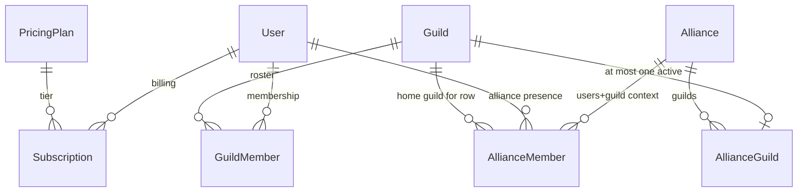

# Core data model

**Last updated:** 2026-04-16 (mega **#209** hub; **GearSnapshot** create touches **`GuildMember`** — see **`systems/ocr_ai_gear.md`**)

**Authority:** `guildsync/db/schema.rb` and the corresponding files under `guildsync/app/models/`.

## How to read this map

- **Orientation** for new contributors: who owns what, which join rows gate guild vs alliance access, where billing and plan limits attach.
- **Deeper dives:** [authorization.md](authorization.md) (Pundit + `GuildPolicy`), [systems/subscriptions_user.md](../systems/subscriptions_user.md), [systems/plan_entitlements.md](../systems/plan_entitlements.md), [systems/alliances.md](../systems/alliances.md), [systems/guilds_crud.md](../systems/guilds_crud.md).

## Entity relationships (high level)

## User

**File:** `guildsync/app/models/user.rb`

| Area | Notes |
|------|--------|
| **Guild access** | **`has_many :guild_members`** → **`has_many :guilds, through: :guild_members`**. Ownership: **`has_many :owned_guilds`** (**`Guild`**, **`owner_id`**). |
| **Billing** | **`has_many :subscriptions`**, **`has_one :current_subscription, -> { current }`**. **`Subscription.current`** = **`active`** or **`trialing`**. See **`systems/subscriptions_user.md`**. |
| **Discord** | **`has_one :user_discord_connection`** (bot/API identity); separate from per-guild Discord settings on **`Guild`**. |
| **Alliance** | **`has_many :alliance_members`** → **`has_many :alliances, through: :alliance_members`**. |
| **Auth / MFA** | Devise + JWT; **`preferred_locale`**, **`auth_method`**, MFA fields — see **[authentication_mfa.md](authentication_mfa.md)**. |

**Plan helpers** (representative): **`current_plan`**, **`subscribed?`**, **`trial_active?`**, **`plan_allows?(feature)`** (used from controllers/views), trial/downgrade flows — keep **`plan_entitlements.yml`** + **`PlanEntitlementService`** in mind.

## Guild

**File:** `guildsync/app/models/guild.rb`

| Area | Notes |
|------|--------|
| **Lifecycle** | **`owner_id`**, **`archived_at`**, **`scheduled_purge_at`** (**`ARCHIVE_RETENTION_PERIOD`**), scopes **`not_archived`** / **`archived`** / **`purge_ready`**. |
| **Members** | **`has_many :guild_members`**, **`has_many :members, through: :guild_members, source: :user`**. |
| **Discord** | **`has_one :guild_discord_setting`**, **`has_one :discord_connection`**, events/roles sync — see **[discord_bot.md](discord_bot.md)**. |
| **Feature data** | Events, polls, loot rolls, documents, folders, gear, applications, invites, tags, warnings — see system maps per feature. |
| **Alliance** | **`has_many :alliance_guild_memberships`**, **`has_one :alliance_guild, -> { where(status: :active) }`**, **`has_one :alliance, through: :alliance_guild`**. **`has_many :alliance_members`** (rows linking this guild’s context in an alliance). |
| **Permissions** | Discord-linked role IDs + boolean flags on **`Guild`** (**`permission_role_*`**, **`role_*_*`**) — detail in **`systems/guild_role_permissions.md`**; enforcement in **[authorization.md](authorization.md)** and **`Guild#role_permission_enabled_for?`**. |

## GuildMember (membership hub)

**File:** `guildsync/app/models/guild_member.rb`

- **`enum :role`** — **`member`**, **`moderator`**, **`admin`**, **`owner`** (in-app role ladder; Discord role mapping is separate).
- **`enum :status`** — **`active`**, **`inactive`**, **`banned`**.
- **Limits** — creation validates owner’s **`current_plan`** **`max_members_per_guild`** (unless unlimited).
- **Side effects** — **`after_commit`** hooks sync alliance membership and IP audit; see **`systems/alliances.md`** for alliance coupling.
- **AI stat scans** — when a **`GearSnapshot`** is **created** (web or Discord upload), **`GearSnapshot`** **`after_commit`** **`touch`**es that user’s **`GuildMember`** row for the guild so membership **`updated_at`** reflects recent scans; display “last updated” for gear uses **`GearSnapshot#last_activity_at`** (**`[created_at, updated_at].max`**). See **`systems/ocr_ai_gear.md`**.

## Alliance

**File:** `guildsync/app/models/alliance.rb`

- **`belongs_to :leader_guild`**, **`belongs_to :leader_user`**.
- **`enum :status`** — **`active`**, **`disbanded`**.
- **`has_many :alliance_guilds`**, **`has_many :guilds, through: :alliance_guilds`**.
- **`has_many :alliance_members`**, **`has_many :users, through: :alliance_members`**.
- Child features: invites, join requests, polls, loot rolls, messages, tags, activity logs — **`systems/alliances.md`**.

## AllianceGuild (guild ↔ alliance)

**File:** `guildsync/app/models/alliance_guild.rb`

- **`enum :status`** — **`active`**, **`pending_invite`**, **`left`**, **`kicked`**.
- Uniqueness: one row per **`(alliance_id, guild_id)`**; validation prevents a guild having two **`active`** alliance memberships.

## AllianceMember (user in alliance)

**File:** `guildsync/app/models/alliance_member.rb`

- **`belongs_to :user`**, **`belongs_to :alliance`**, **`belongs_to :guild`** (the member’s **home** guild in that alliance).
- **`enum :role`** — **`member`**, **`officer`**, **`gm`**.
- **`enum :status`** — **`active`**, **`removed`**.
- **Constraint** — at most one **`active`** alliance membership per user across alliances (custom validation).

## Subscription

**File:** `guildsync/app/models/subscription.rb`

- **`enum :status`** — **`active`**, **`canceled`**, **`expired`**, **`trialing`**.
- **`scope :current`** — **`active`** or **`trialing`** (used by **`User#current_subscription`**).
- Stripe and trial fields — **`systems/stripe_webhooks.md`**, **`overall/billing_stripe_flow.md`**.

## DirectMessage (message center)

Optional **`guild_id`** scopes threads; see **`systems/direct_messages.md`** and **`systems/message_center.md`**.

## Spec pointers

- Model behavior: **`spec/models/*_spec.rb`** (e.g. **`guild_member_spec`**, **`subscription_spec`**, alliance models).
- Cross-guild rules: **`spec/services/free_plan_downgrade_side_effects_spec.rb`**, alliance request specs listed in **[request_specs_and_gates.md](request_specs_and_gates.md)**.

**Related:** [authorization.md](authorization.md), [app_flow_end_to_end.md](app_flow_end_to_end.md), [request_lifecycle.md](request_lifecycle.md).
